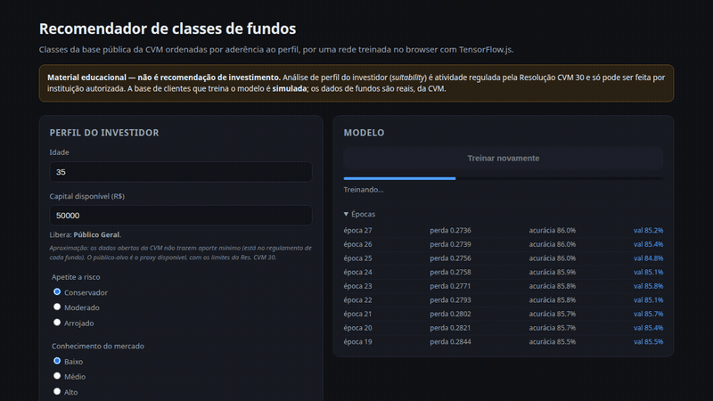

# investment-fund-recommender

Ranks Brazilian investment fund share classes from the CVM public database
against an investor profile (age, capital, risk appetite, market knowledge),
using a neural network trained in the browser with TensorFlow.js.

> **Educational material — not investment advice.**
> Investor suitability assessment is a regulated activity under Brazilian
> CVM Resolution 30 and may only be performed by an authorized institution.
> The fund data is real; **the client base used to train the model is
> simulated** — see [The simulated client base is the project's ceiling](#the-simulated-client-base-is-the-projects-ceiling).



## Two pieces

A 6.4-million-row time series does not fit in a browser, so the project splits
in two:

```
pipeline/   Python. CVM → cleanup → factors → parquet → lean JSON export.
app/        Browser. TF.js in a Web Worker, consumes the JSON.
verificar/  Scripts that drive the real system and check acceptance criteria.
```

> Directory and identifier names are in Portuguese, matching the domain: the
> CVM datasets ship Portuguese column names and the app targets Brazilian
> investors.

## Requirements

| | Version | Used for |
|---|---|---|
| Python | 3.12+ | data pipeline |
| Node.js | 22+ | app and verification |
| Chrome or Chromium | any | only for `verificar:app` and the demo recording |

`puppeteer-core` **does not download a browser** — it uses one already
installed. The scripts look in the usual locations on Linux, macOS and Windows;
if yours lives elsewhere:

```bash
CHROME_PATH=/path/to/chrome npm run verificar:app
```

## Running it

```bash
# 1. Data pipeline — optional, see the note below
python3 -m venv .venv && ./.venv/bin/pip install -r requirements.txt
./pipeline/executar.sh          # downloads ~140 MB from CVM on first run

# 2. App
npm install --prefix app && npm run app     # http://localhost:3000

# 3. Verification
npm install
npm run verificar:treino    # trains in Node and measures validation accuracy
npm run verificar:app       # full cycle in headless Chrome (~3 min, port 8173)
```

**The app does not depend on the pipeline.** The exports in `app/dados/` are
committed on purpose: step 2 alone is enough to see the project working. The
pipeline is only needed to refresh the data.

## Training the model

Training runs **in the browser, inside a Web Worker**, and happens three ways:

| When | What happens |
|---|---|
| Page load | starts on its own, **takes ~110s**, 30 epochs with live progress |
| "Treinar novamente" button | discards the model and retrains from scratch |
| Page reload | retrains from scratch — the model is **not** persisted |

Switching profiles and asking for new recommendations does **not** retrain: it
reuses the in-memory model and responds immediately.

To train outside the browser and measure — this is the path used during
development:

```bash
npm run verificar:treino
```

This loads the **same** ML core the Worker uses
([`app/src/ml/nucleo.js`](app/src/ml/nucleo.js)) over the same JSON files,
trains in Node, and prints validation accuracy, gain over the baseline, and
whether recommended risk tracks the stated risk appetite.

### Training parameters

All in `PARAMETROS`, at the top of [`app/src/ml/nucleo.js`](app/src/ml/nucleo.js):

| Parameter | Value | Effect |
|---|---|---|
| `camadas` (layers) | `[32, 16]` | dense ReLU + sigmoid output; 3,009 parameters total |
| `epocas` (epochs) | `30` | past this, validation stops improving |
| `tamanhoLote` (batch size) | `256` | smaller batches make in-browser training too slow |
| `taxaAprendizado` (learning rate) | `0.005` | Adam; `binaryCrossentropy` loss |
| `negativosPorPositivo` | `3` | negatives per positive; pins the baseline at 75% |
| `fracaoValidacao` | `0.2` | fraction of **clients**, not of rows |
| `semente` (seed) | `20260915` | see the reproducibility caveat |
| `MAX_REFERENCIAS` | `25` | similar clients consulted on cold start |

### Reproducibility: what the seed covers

`semente` feeds a custom PRNG that drives **negative sampling and the
train/validation shuffle**. Running twice yields exactly the same dataset.

**It does not cover TensorFlow.js weight initialization**, which is not seeded.
Each training run therefore converges to a slightly different model: accuracy
stays stable (85.2%–85.7% across 4 measured runs), but the ranking for the
*moderate* profile drifts — see [Known rough edges](#known-rough-edges).

## The data

Two datasets from the CVM Open Data Portal (CVM is Brazil's securities
regulator, equivalent to the SEC):

| File | Contents |
|---|---|
| `FI/CAD/DADOS/registro_fundo_classe.zip` | current registry (CVM Resolution 175) |
| `FI/DOC/INF_DIARIO/DADOS/inf_diario_fi_AAAAMM.zip` | daily quotas, 12 months |

`cad_fi.csv` is legacy and shows only 22 active funds — the database migrated to
a fund/class/subclass structure. The right file is `registro_classe.csv`, with
**33,708 share classes in normal operation**.

**The 12-month window is relative to the run date** and always excludes the
current month, because CVM only publishes a complete daily report after the
month closes — a partial month would bias volatility. Running the pipeline on a
different date shifts the window and changes every number below.

### From the registry to the investable universe

| Classes | Filter |
|---:|---|
| 36,711 | full registry |
| 33,708 | in normal operation |
| 25,190 | with published daily quotas |
| 3,515 | `NR_COTST > 100` (retail cutoff) |
| 3,372 | not exclusive |
| 3,369 | required fields present |
| **3,299** | **with a 12-month risk series** |

The retail cutoff is mandatory: the median unitholder count across all classes
is **2**. Without it the recommender suggests single-investor funds, which is
meaningless.

### Risk is computed, not labeled

Annualized volatility of the quota's log returns over 12 months:

| Classification | n | p25 | median | p75 |
|---|---:|---:|---:|---:|
| FMP-FGTS | 53 | 24.93 | **25.23** | 28.51 |
| Equities | 722 | 16.31 | **18.07** | 20.83 |
| FX | 32 | 10.61 | **10.65** | 10.67 |
| Multi-strategy | 1,176 | 2.86 | **5.20** | 9.86 |
| Fixed income | 1,316 | 0.05 | **0.30** | 1.78 |

Risk bands 1–5 come from **quintiles of that distribution**, not from a label.
The ordering fixed income < multi-strategy < equities is an acceptance
criterion: if it inverts, the pipeline fails.

### Where to change each behaviour

| Constant | File | Effect |
|---|---|---|
| `CORTE_COTISTAS = 100` | [`pipeline/02_universo.py`](pipeline/02_universo.py) | retail cutoff; `1000` shrinks it to 1,518 classes and skews to fixed income |
| `MESES_JANELA = 12` | [`pipeline/comum.py`](pipeline/comum.py) | size of the daily-quota window |
| `MIN_OBSERVACOES = 120` | [`pipeline/03_risco.py`](pipeline/03_risco.py) | minimum trading days per class; drops new funds |
| `PREGOES_ANO = 252` | [`pipeline/03_risco.py`](pipeline/03_risco.py) | annualization factor for volatility |
| `PESOS` | [`pipeline/pesos.py`](pipeline/pesos.py) | weight of each block in the vector; ordering follows CVM Res. 30 |
| `QUANTIS_RISCO` | [`pipeline/pesos.py`](pipeline/pesos.py) | cut points for the 5 risk bands |
| `VERSAO_ESQUEMA` | [`pipeline/pesos.py`](pipeline/pesos.py) | **bump it on any change to the two rows above** |
| `N_CLIENTES = 3000` | [`pipeline/simulacao_clientes.py`](pipeline/simulacao_clientes.py) | size of the simulated base |
| `PROB_RUIDO = 0.18` | [`pipeline/simulacao_clientes.py`](pipeline/simulacao_clientes.py) | fraction holding a position outside their risk band |
| `MIN_ADESOES, MAX_ADESOES` | [`pipeline/simulacao_clientes.py`](pipeline/simulacao_clientes.py) | portfolio size (3 to 10) |

## The model

`(profile, class)` pair → probability of holding. A `32→16→1` network, 3,009
parameters over 63,936 training rows.

**Validation accuracy: 85.7%**, against a 75.0% baseline — the model that
answers "no" to everything, since there are 3 negatives per positive. The ~11
percentage-point gain over that baseline is the number that matters: accuracy
alone is misleading here.

Train and validation split **by client**, not by row: a client's vector repeats
across all their rows, so splitting by row would leak half of each client's
portfolio to the other side.

### Negative sampling

A full cartesian product of clients × classes would be 3,000 × 3,299 =
**9.9 million** pairs, 99.8% of them labeled 0. That does not fit in a browser,
and would produce a model that scores well by always saying "no". Instead each
positive gets 3 sampled negatives — 79,840 rows in total.

## The simulated client base is the project's ceiling

There is no public record of who invested in what, and "suitable for this
profile" is not an observable fact — it is a judgment.
[`pipeline/simulacao_clientes.py`](pipeline/simulacao_clientes.py) generates
3,000 clients whose holdings are drawn **with probability proportional to each
fund's real unitholder count**, filtered by legal eligibility.

What keeps this from being the reflection of an `if` statement:

- **real popularity** — the draw follows `NR_COTST`, not a uniform catalogue;
- **heterogeneity** — mean Jaccard between portfolios in the same profile
  bucket: **0.008**;
- **deliberate noise** — 16.1% of conservative clients hold one high-risk
  position.

**Honest caveat:** the ceiling on what the model can learn is this generator.
It discovers nothing new about the market. Any reading of the results has to go
through that fact.

## Three pitfalls that cost time

1. **The tax ID is formatted differently in the two datasets.** `INF_DIARIO`
   ships `00.017.024/0001-53`; `registro_classe` ships `00332266000131`. A
   direct join returns **zero rows** — no error, just an empty dataframe.
   Normalized to digits only, it returns 25,529.

2. **The legacy structure overlaps the new one.** A few dozen tax IDs publish
   two class-level rows for the same date, one under `TP_FUNDO_CLASSE = 'FI'`
   and another under `'CLASSES - FIF'` — a trace of the Resolution 175
   migration. That is 88 rows across 12 months, enough to duplicate log returns.

3. **Averaging user vectors breaks the recommendations** — detailed below.

### Cold start, and why the first solution was wrong

A new profile has no history, therefore no centroid. The first approach was to
inherit the **mean centroid** of similar simulated clients. It sounds reasonable
and it is wrong:

| appetite | actual portfolio | top-10 with individual vector | top-10 with bucket centroid |
|---|---:|---:|---:|
| conservative | 1.39 | 1.20 | 1.00 |
| moderate | 2.72 | **2.72** | **3.80** |
| aggressive | 4.46 | 4.71 | 5.00 |

The moderate profile was getting equity funds at 13.8% volatility when
simulated moderate clients hold 3.0%. The cause is not vector magnitude — the
norms match, ratio ~0.95 — it is **shape**. The model trains on individual
centroids, which are concentrated: a client holds 3 to 10 classes, so only a few
one-hot positions carry mass. Averaging hundreds of those centroids spreads mass
across nearly every position, and the resulting pair looks like nothing seen in
training.

**The fix is to average scores, not vectors:** a new profile scores the
catalogue using each of 25 similar clients' own vectors — all inside the
training distribution — and the final score is the mean. The moderate profile
returned to band 2.5. `verificar/treino.node.mjs` carries a criterion that locks
this regression out.

## Known rough edges

- **The moderate profile's ranking varies between training runs.** Accuracy is
  stable (85.2%–85.7%), but the mean top-10 risk band for the moderate profile
  swings between ~1.0 and ~3.3, for the reason given in
  [Reproducibility](#reproducibility-what-the-seed-covers). Conservative and
  aggressive profiles are stable; the moderate one sits between two modes and is
  sensitive. Verification locks the **ordering** between profiles, which always
  holds, rather than an absolute band.
- **In-browser training takes ~110s.** Serving a model pre-trained by the
  pipeline would fix it, at the cost of losing the visible training demo.
- **70 classes are dropped** (3,369 → 3,299) for having too short a series.

## Verification

Nothing here is declared done without evidence. Every pipeline stage fails loudly
if its acceptance criterion does not hold — that is how the tax ID and legacy
structure pitfalls surfaced, instead of silently becoming wrong numbers.

- **`verificar/treino.node.mjs`** — trains in Node over the same ML core the
  Worker uses, measuring accuracy, gain over baseline, and appetite × risk
  coherence.
- **`verificar/app.browser.mjs`** — serves the app, opens it in headless Chrome,
  waits for training, requests recommendations for three profiles and checks the
  list, its ordering, the presence of the regulatory disclaimer, and the absence
  of console errors.

## Demo recording

`npm run demo` drives the app headless and records from inside the browser,
producing an MP4 for social media and the GIF shown above. Training takes ~114s
and does not fit a short demo, so recording happens in real time and speed-up is
applied afterwards per segment — 16× over training, 1.2× over the results list,
which has to stay readable.

## License

Code under [MIT](LICENSE).

**The data is not covered by the code license.** `app/dados/classes.json`
embeds data from the [CVM Open Data Portal](https://dados.cvm.gov.br/dados/FI/),
subject to CVM's terms of use. The JSON carries its extraction date in
`geradoEm`.
